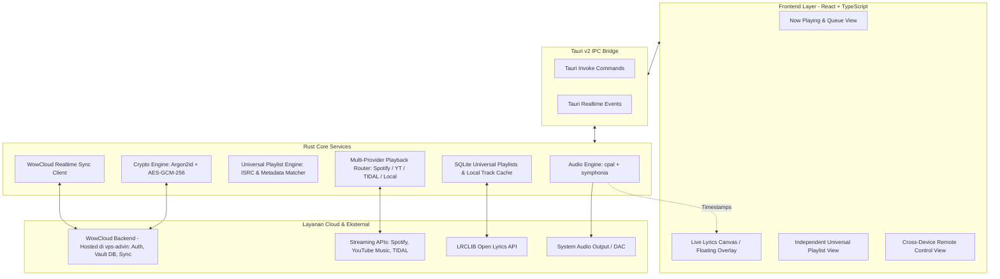

# Arsitektur Sistem WowMusicPlayer

Dokumen ini merinci rancangan teknis dan arsitektur internal **WowMusicPlayer**, mencakup sistem playlist mandiri, router multi-provider, komponen Rust, sistem enkripsi cloud vault, dan pipeline audio.

---

## 1. Gambaran Umum Sistem



---

## 2. Modul-Modul Utama

### 2.1 Independent Universal Playlist Engine
- **Universal Track Metadata Schema**:
  - Setiap trek memiliki identifier unik dan referensi multi-provider:
    ```json
    {
      "id": "trk_0182",
      "title": "Starboy",
      "artist": "The Weeknd, Daft Punk",
      "album": "Starboy",
      "duration_secs": 230,
      "isrc": "USUM71607007",
      "available_providers": ["Spotify", "YouTubeMusic", "Tidal", "Local"],
      "preferred_provider": "Auto"
    }
    ```
- **Penyatuan Playlist Lintas Layanan**:
  - Pengguna dapat membuat "Super-Playlist" yang mencampur lagu dari berbagai sumber tanpa memedulikan batas antar-aplikasi.
  - Mendukung impor dari link publik Spotify, YouTube Music, dan Apple Music.

### 2.2 Multi-Provider Playback Router
- Pengguna bebas memilih ingin memutar lagu melalui **Spotify**, **YouTube Music**, **TIDAL**, atau **File Lokal**.
- Jika provider utama sedang offline atau tidak memiliki lagu tertentu, router secara otomatis mengalihkan aliran pemutaran ke provider alternatif (*smart fallback*).

### 2.3 Audio Pipeline Native Rust
- Menggunakan `cpal` dan `symphonia` untuk decoding dan buffering audio PCM berkualitas tinggi.
- Output murni ke DAC eksternal via mode eksklusif (WASAPI Exclusive, CoreAudio, ALSA).
- Gapless playback antar-lagu.

### 2.4 WowCloud Vault & Client-Side Encryption
- Sesi dan token ketiga pihak (Spotify OAuth, TIDAL token, sesi YouTube) dienkripsi lokal dengan **AES-256-GCM + Argon2id** sebelum disinkronkan ke server backend di `vps-advin`.
- Zero-knowledge: server cloud tidak dapat membaca kredensial pengguna dalam bentuk plain-text.

### 2.5 Live Lyrics Engine
- Bertenaga **LRCLIB Open API** untuk lirik real-time kata-demi-kata bergaya karaoke.
- Dukungan *desktop floating overlay* dan *click-to-seek*.
