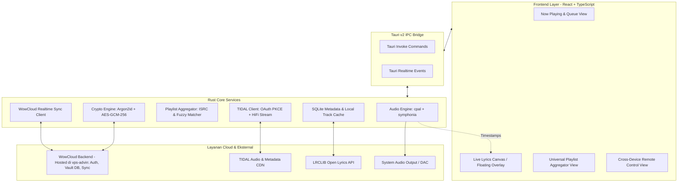

# Arsitektur Sistem WowMusicPlayer

Dokumen ini merinci rancangan teknis dan arsitektur internal **WowMusicPlayer**, mencakup diagram alur data, komponen Rust, sistem enkripsi cloud vault, dan pipeline audio.

---

## 1. Gambaran Umum Sistem



---

## 2. Modul-Modul Utama

### 2.1 Audio Pipeline & Bit-Perfect Engine
- **Audio Output Backend (`cpal`)**:
  - Menginisialisasi audio device dengan sample rate native dari trek yang sedang diputar.
  - Mendukung mode **Exclusive** (WASAPI di Windows, ALSA direct di Linux) untuk mencegah intervensi resampler OS.
- **Audio Demuxing & Decoding (`symphonia`)**:
  - Mendekode stream FLAC murni, AAC, MP3, dan WAV ke buffer PCM float32/int24 secara real-time.
- **Clock & Jitter Management**:
  - Mengirimkan event timestamp dengan presisi tinggi ke UI untuk memandu sinkronisasi lirik kata-demi-kata.

### 2.2 WowCloud Vault & Client-Side Encryption
Untuk menjaga privasi dan keamanan tingkat tinggi:
1. Pengguna memasukkan Master Password / Biometrik saat login ke akun WowMusic.
2. Kunci enkripsi klien di-generate menggunakan **Argon2id** dari password pengguna.
3. Kredensial sensitif (TIDAL refresh token, Spotify session) dienkripsi secara lokal dengan **AES-256-GCM** sebelum disinkronkan ke server cloud di `vps-advin`.
4. Server cloud hanya menyimpan ciphertext terenkripsi (Zero-Knowledge Architecture).

### 2.3 Universal Playlist Aggregator & ISRC Matcher
- Alur Ingestion:
  1. Pengguna memasukkan link playlist (Spotify, YouTube Music, atau Apple Music).
  2. Modul pengurai mengambil daftar judul lagu, artis, durasi, dan ISRC.
  3. Mesin pencari querying ke katalog TIDAL Open API menggunakan ISRC sebagai kunci utama.
  4. Jika ISRC tidak tersedia, algoritma *Levenshtein Distance fuzzy matching* mencocokkan Nama Lagu + Nama Artis dengan toleransi durasi ±3 detik.
  5. Hasil disimpan ke SQLite lokal dan dicadangkan ke akun cloud pengguna.

### 2.4 Live Lyrics Engine
- Multi-tier fallback:
  - Level 1: Mengambil lirik berlisensi dari TIDAL API (`/tracks/{id}/lyrics`).
  - Level 2: Mengambil lirik dari API terbuka **LRCLIB** menggunakan parameter `track_name`, `artist_name`, `album_name`, dan `duration`.
  - Level 3: Membaca file `.lrc` lokal di samping file audio.
- Format lirik parsed menjadi objek linier dengan timestamp milidetik untuk rendering 60 FPS pada UI Canvas.

---

## 3. Struktur Direktori Proyek yang Direncanakan
```text
WowMusicPlayer/
├── AGENTS.md                  # Panduan AI Agent
├── README.md                  # Dokumentasi publik proyek
├── ARCHITECTURE.md            # Cetak biru arsitektur teknis
├── SECURITY.md                # Kebijakan keamanan & enkripsi
├── PRD.md                     # Product Requirement Document
├── src-tauri/                 # Backend Rust (Tauri Core)
│   ├── Cargo.toml
│   └── src/
│       ├── main.rs
│       ├── audio/             # cpal & symphonia engine
│       ├── tidal/             # TIDAL SDK & OAuth PKCE
│       ├── aggregator/        # ISRC fuzzy playlist matcher
│       ├── vault/             # AES-256-GCM & Argon2id crypto
│       ├── lyrics/            # LRCLIB & lyrics parser
│       └── sync/              # Cloud sync & device handoff
├── src/                       # Frontend (React + TypeScript)
│   ├── components/            # Player, Lyrics, Playlist, CloudSettings
│   ├── hooks/                 # Tauri IPC bindings
│   ├── stores/                # Zustand state stores
│   └── App.tsx
└── package.json
```
