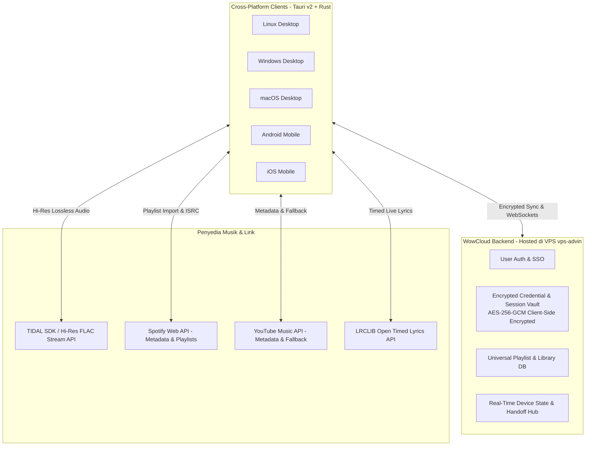

# Product Requirement Document (PRD)
## Proyek: WowMusicPlayer
**Status:** `ACTIVE / BASELINE`  
**Versi:** `0.4.0`  
**Target Platform:** **Full Cross-Platform** (Linux, Windows, macOS, Android, iOS)  
**Penyusun:** Antigravity AI & Abdul Muqsith  

---

## 1. Ringkasan Eksekutif & Visi Produk

### 1.1 Visi
**WowMusicPlayer** adalah *unified cross-platform music player & cloud hub* yang fokus pada **kemurnian kualitas audio (Audiophile-Grade Hi-Res/Bit-Perfect)** dan **sentralisasi perpustakaan musik pengguna**. 

Aplikasi ini memecahkan masalah fragmentasi playlist musik yang tersebar di berbagai platform (Spotify, YouTube Music, Apple Music, TIDAL, dan File Lokal) dengan menyatukannya ke dalam satu aplikasi berantarmuka modern, ringan, dan elegan.

Melalui **WowCloud Ecosystem**, pengguna cukup login sekali (*Single Sign-On*). Seluruh kredensial streaming, sesi akun pihak ketiga, dan playlist terenkripsi secara aman (*Zero-Knowledge Vault*) sehingga langsung tersinkronisasi di semua perangkat (Desktop & Mobile) tanpa perlu otentikasi ulang.

### 1.2 Pilar Nilai Produk (*Value Proposition*)
1. **Universal Multi-Platform Playlist Aggregator**: Mengumpulkan, menyinkronkan, dan merekap playlist yang terpecah di Spotify, YouTube Music, Apple Music, TIDAL, dan File Lokal menjadi *Universal Super-Playlists*.
2. **Audio Up-Resolution Playback**: Secara otomatis mencocokkan trek dari Spotify/YT Music via kode ISRC ke katalog **TIDAL HiFi/Master (FLAC Lossless)** untuk kenikmatan audio resolusi tinggi.
3. **WowCloud Account & Zero-Knowledge Vault**:
   - Satu akun cloud untuk menyinkronkan seluruh sesi, token OAuth, dan playlist.
   - Enkripsi *client-side* (AES-256-GCM + Argon2id) menjamin kerahasiaan token dan privasi data pengguna.
   - *Cross-Device Handoff*: Transfer dan kendalikan pemutaran musik antar-perangkat secara mulus (Desktop ke Smartphone).
4. **Immersive Real-Time Live Lyrics Engine**: Lirik tersinkronisasi kata-demi-kata bergaya karaoke (*word-by-word glow*) bertenaga LRCLIB & TIDAL, dilengkapi *desktop floating overlay widget*.
5. **Audiophile-Grade Bit-Perfect Engine**: Engine audio native Rust dengan dukungan output bit-perfect (WASAPI Exclusive, CoreAudio Hog Mode, ALSA Direct) untuk DAC eksternal tanpa kompresi OS.

---

## 2. Arsitektur Sistem Terintegrasi

---

## 3. Spesifikasi Fungsional Rinci

### 3.1 Modul 1: Universal Playlist Aggregator & Smart Matcher
- **Multi-Source Playlist Ingestion**:
  - Tempel link URL publik (Spotify, YouTube Music, Apple Music).
  - Sinkronisasi otomatis akun Spotify / YT Music yang terhubung melalui Cloud Vault.
  - Impor file playlist lokal (`.m3u`, `.m3u8`, `.csv`, `.json`).
- **ISRC & Intelligent Matcher**:
  - Mengambil metadata lagu dan International Standard Recording Code (ISRC).
  - Mencocokkan lagu ke katalog **TIDAL HiFi/Master** untuk memutarnya dalam kualitas FLAC lossless.
  - Algoritma pencocokan cerdas (*fuzzy matching* judul + artis + toleransi durasi ±3 detik).
  - Indikator akurasi kecocokan trek (`100% HiFi Lossless Match`, `Alternative Version`, `Fallback YouTube Audio`).
- **Super-Playlist Management**:
  - Menggabungkan beberapa playlist lintas platform menjadi satu antrean utuh.
  - Pembersihan otomatis lagu duplikat (*deduplication*).

### 3.2 Modul 2: WowCloud Ecosystem & Zero-Knowledge Vault
- **Sistem Akun WowMusic**:
  - Registrasi & login via Email/Password, Google OAuth, atau GitHub OAuth.
- **Client-Side Encrypted Session Vault**:
  - Kredensial sensitif (**TIDAL Refresh Token, Spotify Token, YouTube Music Session Cookies**) dienkripsi secara lokal di perangkat menggunakan **AES-256-GCM** sebelum disinkronkan ke server cloud.
  - Kunci enkripsi diturunkan dari password pengguna menggunakan algoritma **Argon2id** (Zero-Knowledge). Server backend tidak dapat membaca token pengguna.
  - Pengguna cukup login di perangkat baru (misal: install di Android setelah setup di PC), seluruh sesi streaming langsung aktif otomatis.
- **Cross-Device Handoff & Remote Control**:
  - Sinkronisasi state pemutaran real-time via WebSocket ringan.
  - Kontrol volume, pemutaran, dan transfer antrean dari HP ke PC (mirip Spotify Connect).

### 3.3 Modul 3: Immersive Live Lyrics Engine
- **Multi-Source Provider**:
  - Prioritas 1: **TIDAL Official Timed Lyrics API**
  - Prioritas 2: **LRCLIB Open Database** (akses gratis, jutaan lagu, tanpa token)
  - Prioritas 3: File `.lrc` lokal dan scraper metadata.
- **Fitur Tampilan Lirik**:
  - **Dynamic Word-by-Word Glow**: Animasi karaoke kata-demi-kata mengikuti artikulasi vokal.
  - **Click-to-Seek**: Mengetuk baris lirik langsung melompatkan posisi audio ke detik terkait.
  - **Desktop Floating Overlay**: Widget lirik melayang transparan di atas jendela aplikasi lain.
  - **Instrumental Break Detection**: Animasi indikator saat ada jeda instrumen musik yang panjang.

### 3.4 Modul 4: Audiophile-Grade Audio Engine
- **Audio Output Backend (Rust `cpal` + `symphonia`)**:
  - **Linux**: ALSA Direct / PipeWire Pro-Audio.
  - **Windows**: WASAPI Exclusive (Bit-Perfect) & Shared Mode.
  - **macOS / iOS**: CoreAudio (Hog Mode / Low-latency AudioUnit).
  - **Android**: AAudio / OpenSL ES.
- **Fitur Pemutaran**:
  - Auto-switching sample rate mengikuti sumber file (44.1kHz hingga 192kHz).
  - Gapless playback (pemutaran tanpa jeda antar lagu) dan crossfade.
  - Pemutaran file lokal: FLAC, ALAC, WAV, DSD (DSF/DFF), AIFF, MP3, Opus, AAC.
  - 10-band parametric equalizer & ReplayGain.

---

## 4. Pemilihan Stack Teknologi

```mermaid
graph LR
    subgraph Frontend [Presentation Layer - UI]
        ReactUI[React 18+ / TypeScript / Vite]
        Tailwind[Tailwind CSS + Framer Motion]
        LyricsView[Live Lyrics Canvas & Floating Widget]
    end

    subgraph NativeCore [Tauri v2 Core - Rust]
        AudioPipeline[cpal + symphonia Bit-Perfect Engine]
        AggregatorCore[ISRC & Fuzzy Playlist Matcher]
        VaultCore[Argon2id + AES-256-GCM Crypto Engine]
        CloudClient[WebSocket & HTTP Cloud Sync Client]
    end

    subgraph BackendVPS [Backend - Deploy di vps-advin]
        CloudAPI[WowCloud API / Supabase Self-Hosted]
        PostgreSQL[PostgreSQL Database with RLS]
        WSServer[Realtime WebSocket Sync Hub]
    end

    Frontend <--> NativeCore
    NativeCore <--> BackendVPS
```

---

## 5. Roadmap Tahapan Rilis

| Rilis | Milestone | Target Fitur |
| :--- | :--- | :--- |
| **v0.1.0** | MVP Audio & Local Engine | Pemutar audio lokal, bit-perfect engine dasar, gapless playback. |
| **v0.2.0** | TIDAL Streaming & Live Lyrics | TIDAL OAuth PKCE, FLAC streaming, integrasi LRCLIB & TIDAL Timed Lyrics, floating widget. |
| **v0.3.0** | WowCloud & Encrypted Vault | Backend WowCloud di VPS `vps-advin`, sinkronisasi sesi/token terenkripsi, cloud playlist sync. |
| **v0.4.0** | Universal Playlist Aggregator | Import playlist Spotify, YT Music, Apple Music; ISRC matching ke katalog TIDAL. |
| **v0.5.0** | Cross-Device Handoff | Kontrol pemutaran jarak jauh antar perangkat via WebSocket. |
| **v1.0.0** | Full Cross-Platform Stable | Rilis installer resmi Linux, Windows, macOS, Android, dan iOS. |
