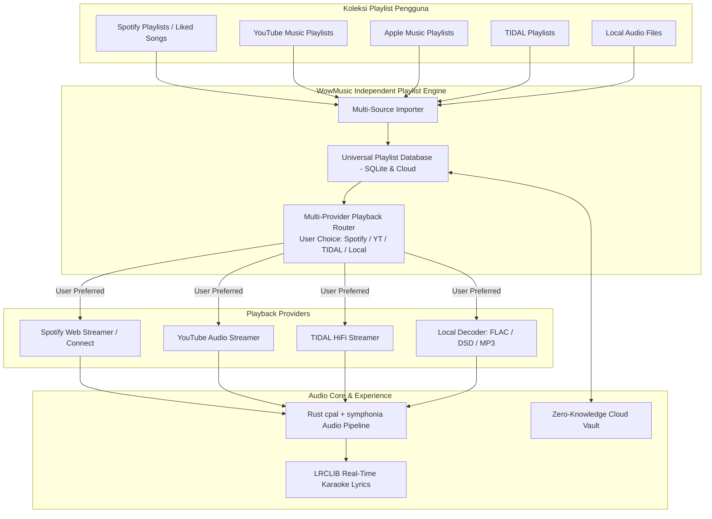

# Product Requirement Document (PRD)
## Proyek: WowMusicPlayer
**Status:** `ACTIVE / BASELINE`  
**Versi:** `0.5.0`  
**Target Platform:** **Full Cross-Platform** (Linux, Windows, macOS, Android, iOS)  
**Penyusun:** Antigravity AI & Abdul Muqsith  

---

## 1. Ringkasan Eksekutif & Visi Produk

### 1.1 Visi Utama: Sistem Playlist Mandiri (Independent Universal Playlist Hub)
**WowMusicPlayer** adalah sistem pemutar musik dan perpustakaan playlist independen yang memecahkan masalah fragmentasi musik. 

Banyak pengguna memiliki koleksi lagu yang terpecah di **Spotify, YouTube Music, Apple Music, TIDAL, dan File Lokal**. WowMusicPlayer hadir untuk merekap dan menyatukan seluruh lagu tersebut ke dalam **Sistem Playlist Mandiri (*Universal Super-Playlists*)**.

**Prinsip Kebebasan Provider (Provider-Agnostic):**
Aplikasi ini **TIDAK mengunci pengguna ke satu layanan tertentu (seperti TIDAL saja)**. Pengguna memiliki kendali penuh dan kebebasan mutlak untuk memilih sumber pemutaran (*Playback Provider*) sesuai layanan dan akun yang mereka miliki:
- Ingin memutar via **Spotify**? Bisa.
- Ingin memutar via **YouTube Music**? Bisa.
- Ingin memutar via **TIDAL HiFi**? Bisa.
- Ingin memutar via **File Lokal / Offline Storage**? Bisa.

### 1.2 Pilar Nilai Produk (*Value Proposition*)
1. **Independent Universal Playlist Engine**: Buat, kelola, dan miliki playlist musik Anda sendiri tanpa terikat pada algoritma atau ekosistem tertutup salah satu aplikasi streaming.
2. **Flexible Multi-Provider Playback Router**: Tiap lagu dalam playlist dapat diputar melalui provider yang dipilih pengguna (Spotify, YouTube Music, TIDAL, atau file lokal) dengan fallback otomatis jika lagu tidak tersedia di salah satu platform.
3. **WowCloud Ecosystem & Zero-Knowledge Vault**:
   - Satu akun cloud untuk menyinkronkan seluruh playlist kustom, riwayat lagu, dan preferensi antar-perangkat.
   - Brankas kredensial terenkripsi sisi-klien (*Client-Side AES-256-GCM + Argon2id*) agar pengguna cukup login sekali tanpa resiko privasi.
   - *Cross-Device Handoff*: Kontrol pemutaran di PC dari smartphone atau sebaliknya.
4. **Immersive Real-Time Live Lyrics Engine**: Sinkronisasi lirik kata-demi-kata (LRCLIB & multi-source) dengan *desktop floating overlay* dan *click-to-seek*.
5. **High-Performance Cross-Platform Audio Core**: Engine native Rust (`cpal` + `symphonia`) untuk pemutaran audio berlatensi rendah, hemat memori (< 150MB), dan dukungan output perangkat keras murni (WASAPI, CoreAudio, ALSA).

---

## 2. Arsitektur Sistem Terintegrasi

---

## 3. Spesifikasi Fungsional Rinci

### 3.1 Modul 1: Independent Universal Playlist Engine
- **Pembuatan Playlist Bebas Platform**:
  - Pengguna dapat membuat playlist baru di WowMusicPlayer dan menambahkan lagu dari sumber mana saja (campuran antara lagu Spotify, trek YouTube Music, lagu TIDAL, dan file FLAC lokal dalam satu antrean pemutaran).
- **Impor Cepat Multi-Layanan**:
  - Impor via URL tautan publik (Spotify, YouTube Music, Apple Music).
  - Sinkronisasi akun otomatis untuk membaca playlist pribadi pengguna.
  - Impor/Ekspor file playlist standar (`.m3u`, `.m3u8`, `.csv`, `.json`).
- **Pembersihan & Deduplikasi**:
  - Algoritma pencocokan metadata (ISRC, Judul, Artis) untuk mendeteksi lagu ganda di berbagai platform dan memberikan opsi konsolidasi.

### 3.2 Modul 2: Multi-Provider Playback Router (Kebebasan Pemutar)
- **Pemilihan Provider Fleksibel**:
  - Pengguna dapat mengatur preferensi pemutaran secara global (misal: *"Utamakan Spotify"*, *"Utamakan YouTube Music"*, atau *"Utamakan TIDAL"*).
  - Pengguna juga dapat memilih provider secara manual per-lagu (*Override Provider*).
- **Smart Fallback Mechanism**:
  - Jika lagu tertentu tidak tersedia di provider pilihan (misal: lagu cover indie di YouTube yang tidak ada di Spotify/TIDAL), sistem secara otomatis memutar dari sumber aslinya tanpa menghentikan pemutaran antrean.

### 3.3 Modul 3: WowCloud & Zero-Knowledge Credential Vault
- **Penyimpanan Terenkripsi Client-Side**:
  - Seluruh sesi login dan token layanan (Spotify OAuth, TIDAL token, sesi YouTube) dienkripsi lokal menggunakan **AES-256-GCM** dengan kunci turunan **Argon2id**.
  - Server cloud WowCloud di VPS `vps-advin` hanya menyimpan ciphertext (Zero-Knowledge Architecture).
- **Cross-Device Handoff**:
  - Sinkronisasi antrean lagu dan status pemutaran secara instan antar-perangkat via WebSocket.

### 3.4 Modul 4: Immersive Live Lyrics Engine
- **Penyedia Lirik Terbuka**:
  - Bertenaga **LRCLIB Open API** (akses global tanpa biaya, jutaan lagu tersinkronisasi) dengan fallback ke file `.lrc` lokal dan scraper lirik resmi.
- **Tampilan Interaktif**:
  - Animasi karaoke kata-demi-kata bergulir otomatis (*word-by-word glow*).
  - *Click-to-Seek*: Ketuk lirik untuk lompat langsung ke detik yang diinginkan.
  - *Desktop Floating Overlay*: Widget lirik mengambang transparan di desktop saat player diminimalkan.

### 3.5 Modul 5: High-Performance Audio Engine
- **Engine Native Rust**:
  - Menggunakan `cpal` dan `symphonia` untuk performa tinggi, footprint memori rendah (< 150MB), dan zero memory leaks.
  - Dukungan output perangkat keras audio murni (WASAPI, CoreAudio, ALSA).
  - Pemutaran file lokal: FLAC, ALAC, WAV, DSD, MP3, AAC, Opus.
  - Gapless playback antar-lagu.

---

## 4. Roadmap Rilis

| Rilis | Milestone | Target Fitur |
| :--- | :--- | :--- |
| **v0.1.0** | Audio Core & Scaffolding | Tauri v2 + React 19 + Rust Audio Pipeline + Crypto Vault. |
| **v0.2.0** | Universal Playlist CRUD | Sistem pembuatan playlist mandiri, import URL (Spotify / YouTube Music / Apple Music). |
| **v0.3.0** | Multi-Provider Playback | Router pemutaran fleksibel (Spotify, YouTube Music, TIDAL, Lokal). |
| **v0.4.0** | Live Lyrics & Floating Widget | Integrasi LRCLIB, karaoke glow 60 FPS, desktop floating overlay. |
| **v0.5.0** | WowCloud & Session Sync | Sinkronisasi playlist cloud & brankas sesi terenkripsi (Hosted di `vps-advin`). |
| **v1.0.0** | Cross-Platform Stable Release | Rilis installer Linux, Windows, macOS, Android, dan iOS. |
